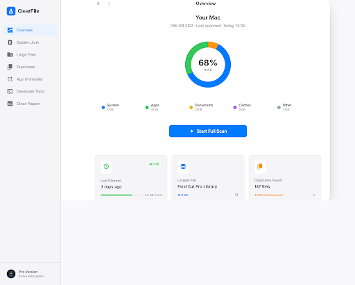
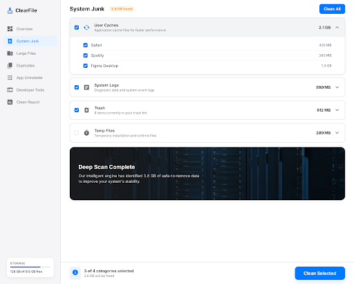
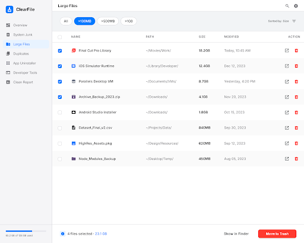
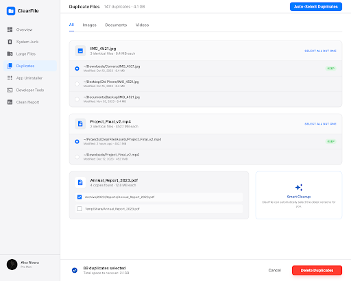
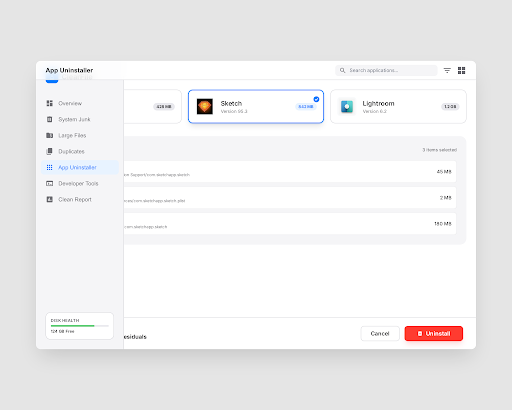
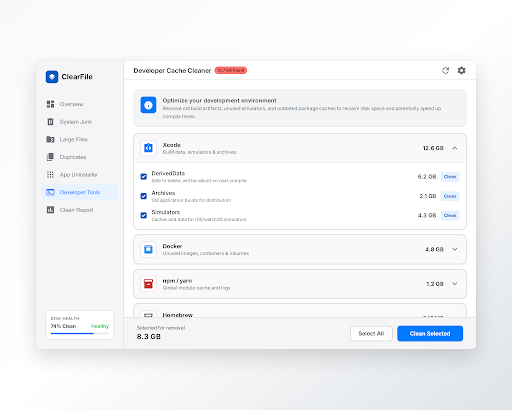
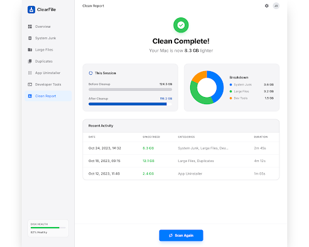
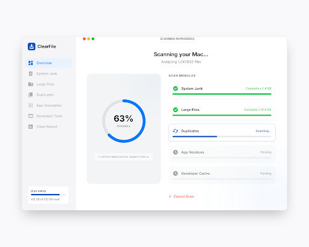

# ClearFile

A native macOS disk cleaner built with Swift and SwiftUI. Scan your disk, remove junk files, find duplicates, and uninstall apps cleanly — all running locally with no data uploaded.



---

## Features

| Module | Description |
|--------|-------------|
| **Disk Overview** | Visual breakdown of disk usage by category |
| **System Junk** | Clean system caches, logs, and Trash |
| **Large Files** | Find and delete files over 50 MB |
| **Duplicate Files** | SHA-256 hash comparison to find exact duplicates |
| **App Uninstaller** | Remove apps and all associated leftover files |
| **Developer Tools** | Clean Xcode DerivedData, npm/yarn cache, Docker builder cache |
| **Clean Report** | History log of every cleaning session |

---

## Screenshots

<table>
  <tr>
    <td><br/><sub>Disk Overview</sub></td>
    <td><br/><sub>System Junk</sub></td>
  </tr>
  <tr>
    <td><br/><sub>Large Files</sub></td>
    <td><br/><sub>Duplicate Files</sub></td>
  </tr>
  <tr>
    <td><br/><sub>App Uninstaller</sub></td>
    <td><br/><sub>Developer Tools</sub></td>
  </tr>
  <tr>
    <td><br/><sub>Clean Report</sub></td>
    <td><br/><sub>Scanning Progress</sub></td>
  </tr>
</table>

---

## Requirements

- macOS 14 Sonoma or later
- Xcode 16+ / Swift 6 (for building from source)

---

## Installation

### Option A — Download prebuilt app

1. Go to [Releases](../../releases) and download the latest `ClearFile.zip`
2. Unzip and drag `ClearFile.app` to your `/Applications` folder
3. On first launch, macOS will show a security warning because the app is not distributed via the App Store. Open **System Settings → Privacy & Security** and click **Open Anyway**

### Option B — Build from source

```bash
git clone https://github.com/your-username/ClearFile.git
cd ClearFile
swift build -c release
```

Then run:

```bash
./.build/release/ClearFile
```

Or open in Xcode:

```bash
open Package.swift
```

Press `⌘R` to build and run.

---

## Permissions

ClearFile requires **Full Disk Access** to scan `~/Library` and system directories.

Grant access at: **System Settings → Privacy & Security → Full Disk Access → enable ClearFile**

Without this permission the scanner will only see your home directory and miss most junk files.

---

## Usage

1. Launch ClearFile
2. Click **Start Scan** on the Overview screen — a full scan takes under 30 seconds on most Macs
3. Navigate to any module in the sidebar to review results
4. Select items to clean and click **Clean** — all deletions move files to Trash first, so nothing is immediately permanent
5. View the **Clean Report** tab to see a history of all cleaning sessions

### Undo

Cleaned files go to the system Trash. You can restore individual files from Trash at any time via Finder before emptying it.

---

## Architecture

```
Sources/ClearFile/
├── ClearFileApp.swift       # App entry point, dependency wiring
├── Models/                  # Data models (ScanModels, DuplicateGroup, etc.)
├── Services/                # Business logic (ScanEngine, CleanEngine, etc.)
├── Views/                   # SwiftUI views per module
└── Utils/                   # Formatters, localization helpers
```

Key services:

| Service | Role |
|---------|------|
| `ScanEngine` | Concurrent recursive file scan, outputs a `FileNode` tree |
| `CleanEngine` | Deletes files by rule set, writes to clean history |
| `DuplicateFinder` | SHA-256 deduplication with group ranking |
| `AppUninstaller` | Resolves bundle ID → all associated Library paths |
| `DevToolsScanner` | Detects installed dev tools and known cache paths |
| `CleanHistoryStore` | SQLite-backed persistence for clean history |

---

## Privacy

- Runs entirely offline — no analytics, no telemetry, no network requests
- File paths never leave your machine
- All deletions go through the system Trash for reversibility

---

## License

MIT — see [LICENSE](LICENSE)
